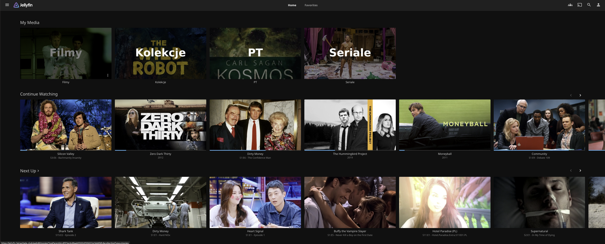

# uncompressed

[](LICENSE)
[](arr/docker-compose.yml)
[](https://uncompressed.media)

**Self-healing, high-quality media pipeline.**

Streaming services compress 4K to 15-25 Mbps. A Blu-ray remux is 60-80 Mbps. I built a self-healing media pipeline that serves full-quality remuxes to my family with a Netflix-like request interface — and they have no idea it's not a commercial service.

10 containers across 2 Docker Compose stacks, running on Unraid. Zero-trust networking via Tailscale, VPN-isolated torrenting with leak-proof namespace isolation.

<p align="center">
  
  
  
</p>

---

## The Problem

I kept running into the same frustrations with streaming:

- **Quality** — 4K on Netflix/Disney+ is 15-25 Mbps HEVC. A UHD Blu-ray remux is 60-80 Mbps. The difference is obvious on a decent display, especially in dark scenes where streaming artifacts crush shadow detail.
- **Availability** — Content disappears when licensing deals expire. Shows split across 5+ services. Regional libraries vary wildly.
- **Control** — No way to choose audio tracks, subtitle sources, or playback behavior. Algorithmic recommendations over catalog browsing.

I wanted something where my family could open an app, search for a movie, hit "request", and have it appear in their library — with Blu-ray quality, automated subtitles in multiple languages, and zero maintenance on their end.

On the client side, my family uses **[Overseerr](https://overseerr.dev)** to request content and **[Infuse](https://firecore.com/infuse)** on Apple TV to watch it. They see a polished, Netflix-like interface — browse, search, request, play. They have no idea what's behind it.

## How It Works

The core is a **9-container arr stack** that automates the entire pipeline:

```
Family member opens Overseerr → requests a movie
  → Radarr picks it up, searches Prowlarr for indexers
    → qBittorrent downloads through VPN tunnel (gluetun namespace)
      → Radarr imports, renames, organizes
        → Bazarr fetches subtitles
          → Jellyfin serves it with hardware transcoding
```

For TV shows, Sonarr does the same thing — monitors series, grabs new episodes automatically, and Jellyfin updates in real time.

The whole pipeline is self-healing. If any container goes down, it gets restarted automatically. If the VPN drops, torrent traffic stops dead — it physically cannot route outside the tunnel.

## Architecture

```
                       ┌────────────┐
                       │ Cloudflare │
                       │    DNS     │
                       └─────┬──────┘
                             │
                       ┌─────┴──────┐
                       │ Tailscale  │
                       │   Mesh     │
                       └─────┬──────┘
                             │
                ┌────────────┴────────────┐
                │      Traefik v2.10      │
                │   Let's Encrypt (ACME)  │
                │  bound to Tailscale IP  │
                └──┬─────┬─────┬──────┬───┘
                   │     │     │      │
       ┌───────────┘     │     │      └───────────┐
       ▼                 ▼     ▼                  ▼
  ┌─────────┐    ┌─────────────────┐
  │Jellyfin │    │   *arr suite    │
  │         │    │ Sonarr  Radarr  │
  │         │    │Prowlarr Bazarr  │
  │         │    │   Overseerr     │
  └─────────┘    └────────┬────────┘
                          │
                 ┌────────┴────────┐
                 │   qBittorrent   │  network_mode: service:gluetun
                 │  bound to tun0  │  (namespace isolation)
                 └────────┬────────┘
                          │
  ┌───────────────────────┼───────────────────────────┐
  │    vpn_network        │                           │
  │              ┌────────┴────────┐                  │
  │              │     Gluetun     │                  │
  │              │ ProtonVPN (WG)  │                  │
  │              │   NL/CH (P2P)   │                  │
  │              └─────────────────┘                  │
  └───────────────────────────────────────────────────┘

```

Two traffic paths, each isolated:

1. **HTTPS ingress** — Cloudflare DNS → Tailscale mesh → Traefik (bound to Tailscale IP only, not `0.0.0.0`) → service by hostname
2. **P2P egress** — qBittorrent → gluetun network namespace (`tun0` binding) → ProtonVPN WireGuard → Netherlands/Switzerland

## Security Model

No ports are open to the public internet. The entire setup is zero-trust:

- **Ingress** — Traefik binds exclusively to the Tailscale IP, not `0.0.0.0`. You must be on the Tailscale mesh to reach any service. HTTPS with auto-renewed Let's Encrypt certs via Cloudflare DNS challenge.
- **VPN leak prevention** — qBittorrent runs inside gluetun's network namespace (`network_mode: service:gluetun`), meaning it literally shares gluetun's network stack. An init script additionally forces `BIND_TO_INTERFACE: tun0`. If the VPN drops, there is no network path for traffic to take — it's not a firewall rule that could be misconfigured, it's a namespace boundary.
- **Network segmentation** — Three Docker networks isolate traffic: `traefik_proxy` for HTTPS, `arr_internal` for service-to-service (marked `internal: true`, no external access), `vpn_network` for tunnel traffic.

## Self-Healing

Every container has an endpoint-specific health check — not just "is the process alive" but "is the service actually responding correctly":

```
health check (curl /health, 30-60s intervals)
  → Docker marks container unhealthy
    → autoheal detects (60s scan)
      → container restart
        → depends_on: service_healthy blocks dependents until recovered
```

Gluetun checks its own `:9999/health` endpoint. qBittorrent verifies both its API response *and* pings `1.1.1.1` through the tunnel. Jellyfin checks `/health`. Each *arr service hits its own health endpoint. If gluetun goes down, all dependent services wait for it to recover before starting — no partial-stack states.

Three independent layers: health checks catch failures, autoheal restarts them, dependency ordering prevents cascading issues.

## Stacks

| Stack | Containers | Purpose |
|-------|-----------|---------|
| [`arr/`](arr/) | Gluetun, qBittorrent, Jellyfin, Sonarr, Radarr, Prowlarr, Overseerr, Bazarr, Autoheal | Media acquisition, streaming, self-healing |
| [`infra/`](infra/) | Traefik v2.10 | Reverse proxy, ACME certs (Cloudflare DNS challenge) |

Other supporting services (DNS, YouTube geo-bypass, books, dashboard, etc.) live in a separate [homelab](https://github.com/Lackoftactics/homelab) repo.

## Technical Details

**VPN namespace isolation** — qBittorrent shares gluetun's network namespace, not just its network. The container has no network interface of its own. An init script (`arr/qbittorrent-init/10-config.sh`) sets `tun0` binding as defense in depth. Port forwarding is automatic — gluetun gets a forwarded port from ProtonVPN and pushes it to qBittorrent's API.

**DRY compose config** — YAML extension fields (`x-arr-env`, `x-restart-policy`) eliminate duplication across services. One change propagates everywhere.

**Hardware transcoding** — Jellyfin uses Intel Quick Sync (`/dev/dri`) for real-time transcoding when clients can't direct-play. Serves full Blu-ray remuxes to capable devices, transcodes on-the-fly for phones/tablets.

## Hardware Requirements

| | Minimum | Recommended |
|---|---------|-------------|
| **CPU** | x86_64 quad-core | Intel with Quick Sync (7th gen+) |
| **RAM** | 8 GB | 16 GB |
| **Storage** | SSD (configs) + HDD (media) | NVMe (configs) + large HDD array |
| **GPU** | Not required | Intel iGPU for hardware transcoding |
| **Network** | 1 Gbps LAN | 1 Gbps+ LAN, stable WAN for VPN |

Not compatible with Raspberry Pi or ARM devices. Runs well on Unraid, Proxmox, or any Linux box with Docker.

## Quick Start

```bash
cp .env.example .env              # configure credentials and domain
docker network create traefik_proxy

cd infra && docker compose up -d  # Traefik (reverse proxy) — start first
cd ../arr && docker compose up -d # media pipeline (9 services)
```

You need: Docker + Compose, a Tailscale account, a ProtonVPN account with WireGuard keys, and a domain with Cloudflare DNS. See [`.env.example`](.env.example) for all configuration options.

## Repository Structure

```
.
├── infra/           # Traefik reverse proxy
└── arr/             # Media pipeline (9 services)
    └── qbittorrent-init/  # VPN interface binding script
```

The only shared dependency between stacks is the `traefik_proxy` Docker network. Other services (DNS, YouTube geo-bypass, books, dashboard) live in the [homelab](https://github.com/Lackoftactics/homelab) repo.

## Contributing

Issues, ideas, and PRs are welcome. If you adapt this for a different VPN provider or NAS platform, I'd love to hear about it.

## License

[MIT](LICENSE) — [Fogbreak Labs](https://fogbreaklabs.com)
